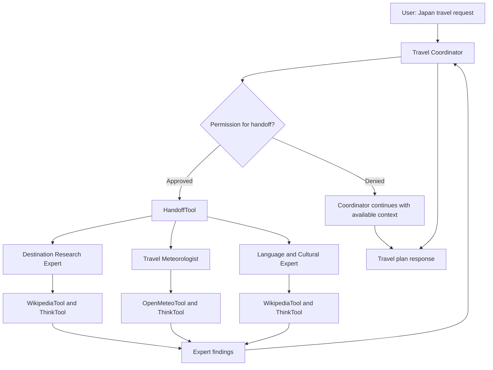
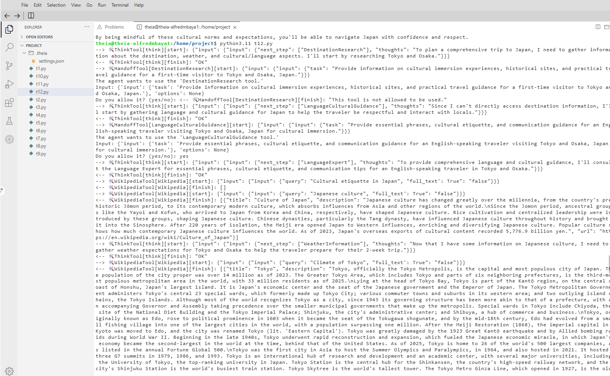
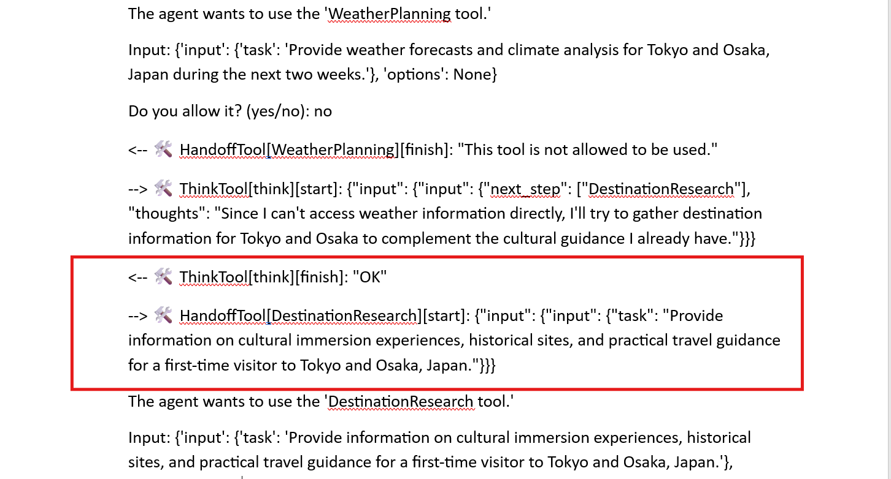
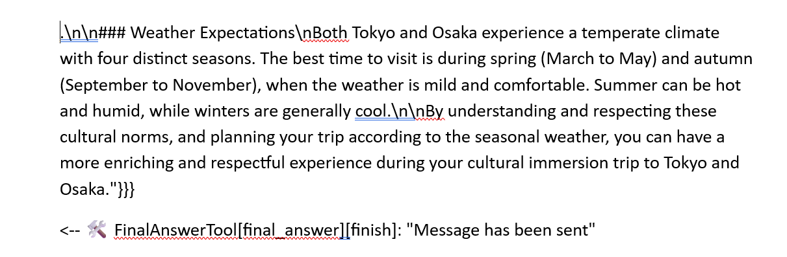
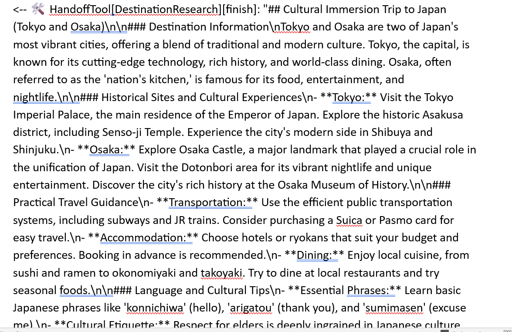

# 🤖 BeeAI Multi-Agent Travel Planning Assistant

A multi-agent travel planning demonstration built with **Python**, the **BeeAI Framework**, and **IBM watsonx.ai**. A Travel Coordinator delegates research to specialist agents for destinations, weather, and language/culture, with **human approval required before handoffs**.

> **Project scope:** This is a command-line educational demonstration using a sample two-week trip to **Tokyo and Osaka, Japan**. It is not a booking application or a live web interface.

## 📑 Table of Contents

- [🎯 Project Overview](#-project-overview)
- [🏗️ Multi-Agent Architecture](#️-multi-agent-architecture)
- [✨ Key Features](#-key-features)
- [🤖 Specialized AI Agents](#-specialized-ai-agents)
- [⚙️ Technology Stack](#️-technology-stack)
- [🔗 Agent Coordination Workflow](#-agent-coordination-workflow)
- [🔐 Human-in-the-Loop Approval](#-human-in-the-loop-approval)
- [🛠️ Tools and Execution Requirements](#️-tools-and-execution-requirements)
- [📊 Execution Results and Limitations](#-execution-results-and-limitations)
- [📸 Execution Screenshots](#-execution-screenshots)
- [📂 Project Structure](#-project-structure)
- [🚀 Running the Application](#-running-the-application)
- [💡 Key Learnings and Future Improvements](#-key-learnings-and-future-improvements)

## 🎯 Project Overview

This project explores **multi-agent orchestration** using the BeeAI Framework. Instead of asking a single agent to handle all travel-planning tasks, a coordinating agent can hand off focused requests to specialized agents:

- **Destination Research Expert:** landmarks, historical sites, transportation, and practical destination guidance.
- **Travel Meteorologist:** weather conditions, packing suggestions, and weather-aware planning.
- **Language & Cultural Expert:** essential language guidance, customs, etiquette, and respectful travel.

All four agents use the **Meta Llama 4 Maverick** model through IBM watsonx.ai. The coordinator combines available specialist findings into a travel-planning response. A user can **approve or deny** specialist handoffs during execution.

The sample traveler asks for a two-week cultural immersion trip to Tokyo and Osaka, focusing on historical sites, local interactions, weather, and respectful communication as an English speaker.

## 🏗️ Multi-Agent Architecture



**Workflow:** User request → Coordinator → Permission check → Approved specialist handoffs → Tool-assisted research → Coordinator synthesis → Travel plan.

> The diagram shows the intended orchestration path. An agent's handoff or tool invocation may be skipped or denied during a particular run.

## ✨ Key Features

- 🤖 **Four role-specific agents** coordinated through `RequirementAgent`.
- 🔀 **Agent handoffs** using `HandoffTool`.
- 🔐 **Human-in-the-loop approvals** with `AskPermissionRequirement`.
- 🧩 **Execution constraints** using `ConditionalRequirement`.
- 🌐 **Destination and cultural research** through `WikipediaTool`.
- 🌤️ **Weather lookup** through `OpenMeteoTool`.
- 🧠 **Agent reasoning support** through `ThinkTool`.
- 🧾 **Tool trajectory logging** with `GlobalTrajectoryMiddleware`.
- 💬 **Agent memory** with `UnconstrainedMemory`.
- 🐍 **Asynchronous Python execution** with `asyncio`.

## 🤖 Specialized AI Agents

| Agent | Responsibility | Configured tools |
|---|---|---|
| **Travel Coordinator** | Interpret the request, delegate, and synthesize findings | Three `HandoffTool` instances, `ThinkTool` |
| **Destination Research Expert** | Attractions, transportation, safety, and seasonal considerations | `WikipediaTool`, `ThinkTool` |
| **Travel Meteorologist** | Weather, climate, packing, and travel precautions | `OpenMeteoTool`, `ThinkTool` |
| **Language & Cultural Expert** | Phrases, etiquette, customs, and respectful communication | `WikipediaTool`, `ThinkTool` |

### Foundation model

```python
llm = ChatModel.from_name(
    "watsonx:meta-llama/llama-4-maverick-17b-128e-instruct-fp8",
    ChatModelParameters(temperature=0)
)
```

Each agent is configured with the same model but receives **different role instructions, tools, and requirements**.

## ⚙️ Technology Stack

| Technology | Purpose |
|---|---|
| **Python / asyncio** | Asynchronous application entry point and execution |
| **BeeAI Framework** | Agents, tool orchestration, handoffs, requirements, and middleware |
| **IBM watsonx.ai** | Hosted foundation model access |
| **Meta Llama 4 Maverick** | Language model used by the agents |
| **WikipediaTool** | Reference lookup for destination/cultural research |
| **OpenMeteoTool** | Weather data retrieval |
| **ThinkTool** | Structured agent reasoning step |
| **GlobalTrajectoryMiddleware** | Tool execution trajectory logging |

## 🔗 Agent Coordination Workflow

The coordinator receives the traveler's request and can delegate work to specialists through named handoff tools:

```python
handoff_to_destination = HandoffTool(
    destination_expert,
    name="DestinationResearch",
    description="Consult our Destination Research Expert for comprehensive information about travel destinations, attractions, and practical travel guidance."
)
```

Equivalent handoffs are configured for `WeatherPlanning` and `LanguageCulturalGuidance`. The coordinator runs the sample prompt and prints the resulting plan:

```python
result = await travel_coordinator.run(query)
print(f"\n📋 Comprehensive Travel Plan:\n{result.answer.text}")
```

##  Human-in-the-Loop Approval

The coordinator requires user approval for each named specialist handoff:

```python
AskPermissionRequirement([
    "DestinationResearch",
    "WeatherPlanning",
    "LanguageCulturalGuidance"
])
```

During a run, the user can approve or deny a requested delegation. This makes agent decisions observable and keeps the human involved in the workflow.

**Important:** A denied handoff does not automatically mean the program stops. The coordinator may proceed using information already available, so its final answer may be less thoroughly researched.

## 🛠️ Tools and Execution Requirements

`ConditionalRequirement` constrains when and how often certain tools can be invoked. For example, the destination agent is configured to use `ThinkTool` before `WikipediaTool`:

```python
ConditionalRequirement(
    WikipediaTool,
    only_after=[ThinkTool],
    min_invocations=1,
    max_invocations=4,
    consecutive_allowed=False
)
```

The weather agent similarly configures `OpenMeteoTool` after `ThinkTool`, with a maximum of one weather-tool invocation per configured execution scope. This is a **tool-call constraint**, not a guarantee that both Tokyo and Osaka will each receive an independent weather lookup.

## 📊 Execution Results and Limitations

The lab execution demonstrated permission prompts, agent handoffs, tool use, and a generated Japan travel plan. In the reviewed runs:

- The user approved some handoffs and denied others, demonstrating interactive delegation controls.
- A weather-tool call returned data for **Tokyo** in one run.
- The coordinator generated a final response even when some specialist handoffs were denied.
- An independent **Osaka weather lookup was not confirmed** in the reviewed output.

**Interpretation:** The script successfully demonstrated multi-agent coordination, but the final travel plan should not be treated as fully verified across every requested destination and topic. Travel details and forecasts should be independently checked before real-world use.

## 📸 Execution Screenshots

### Agent execution



### Human approval of agent handoffs



### Weather tool execution



### Generated travel plan



## 📂 Project Structure

```text
beeai-multi-agent-travel-planner/
├── travel_planner.py       # Multi-agent application
├── requirements.txt        # Dependencies (add after verifying versions)
├── .gitignore              # Ignore local environments and secrets
├── README.md               # Project documentation
└── assets/
    ├── agent-execution.png
    ├── permission-approval.png
    ├── weather-tool.png
    └── final-travel-plan.png
```

## 🚀 Running the Application

### 1. Clone the repository

```bash
git clone https://github.com/MbayaAlfred/beeai-multi-agent-travel-planner.git
cd beeai-multi-agent-travel-planner
```

> Replace the repository URL if your actual GitHub repository has a different owner or name.

### 2. Create a virtual environment

```bash
python -m venv .venv
```

On Windows:

```powershell
.venv\Scripts\activate
```

On macOS/Linux:

```bash
source .venv/bin/activate
```

### 3. Install dependencies

After adding a verified `requirements.txt` based on your working lab environment:

```bash
pip install -r requirements.txt
```

The application uses the `beeai_framework` package. Dependency versions and compatibility should be verified against the lab environment before publishing installation instructions as reproducible.

### 4. Configure IBM watsonx.ai access

Set up the IBM watsonx credentials and project configuration required by the BeeAI backend **using environment variables or another supported secure configuration method**. Do not commit API keys, passwords, or access tokens to GitHub.

### 5. Run the script

```bash
python travel_planner.py
```

The program runs the sample Japan prompt and may request permission for specialist handoffs in the terminal.

**Entry point check:** Ensure `travel_planner.py` ends with:

```python
if __name__ == "__main__":
    asyncio.run(main())
```

## 💡 Key Learnings and Future Improvements

### Key learnings

- **Multi-agent specialization:** Different agents can handle destination, weather, and cultural questions.
- **Delegation:** `HandoffTool` lets a coordinator consult specialists.
- **Human oversight:** Permission requirements make specialist handoffs subject to user approval.
- **Execution controls:** Conditional requirements shape tool invocation order and frequency.
- **Observability:** Trajectory middleware exposes tool activity during execution.
- **Grounding limits:** A generated answer is not necessarily verified when tools are skipped or permissions are denied.

### Potential improvements

- Accept destinations, dates, and traveler preferences as runtime input rather than a hardcoded prompt.
- Ensure weather retrieval is checked separately for **both Tokyo and Osaka**.
- Add explicit source references and validation checks to the final response.
- Add automated tests for handoff approval, denial, and missing-tool-result scenarios.
- Optionally create a web interface in a future version; **the current project is terminal-based**.

---

**Project focus:** Agentic AI • Multi-Agent Orchestration • Human-in-the-Loop • BeeAI Framework • IBM watsonx.ai
